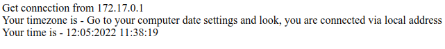
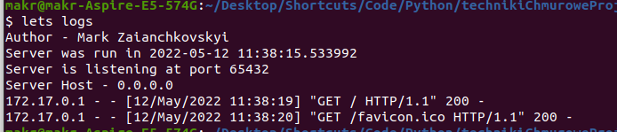

# Technologie Chmurowe. Zadanie 1

## Requirements
- Docker
- Lets CLI (Optional)

## Zadanie 1
Server code  
- https://github.com/Fan4ik20/TC_task1/tree/master/server
## Zadanie 2
DockerFile  
- https://github.com/Fan4ik20/TC_task1/blob/master/Dockerfile
## Zadanie 3
- Building server image:
  - `docker build -t date_server .`
  - `lets build`
- Running server container:
  - `docker run -d -p 65432:65432 --name date_server_container date_server`
  - `lets run` or `lets build-and-run`
- Showing container logs:
  - `docker logs date_server_container`
  - `lets logs`
- Showing image layers:
  - `sudo docker image inspect date_server` | `sudo docker history date_server`
  - `lets inspect` | `lets history`  
 

## Zadanie 4
DockerHub
- https://hub.docker.com/repository/docker/fan4ik/zadanie1
### Commands
- `sudo apt-get install qemu-user-static`
- `docker buildx create --name zadanie1`
- `docker buildx use zadanie1`
- `docker buildx build -t fan4ik/zadanie1:bx
--platform linux/amd64,linux/arm64,linux/arm/v7 --push .`

## Client Side  

## Server Logs

